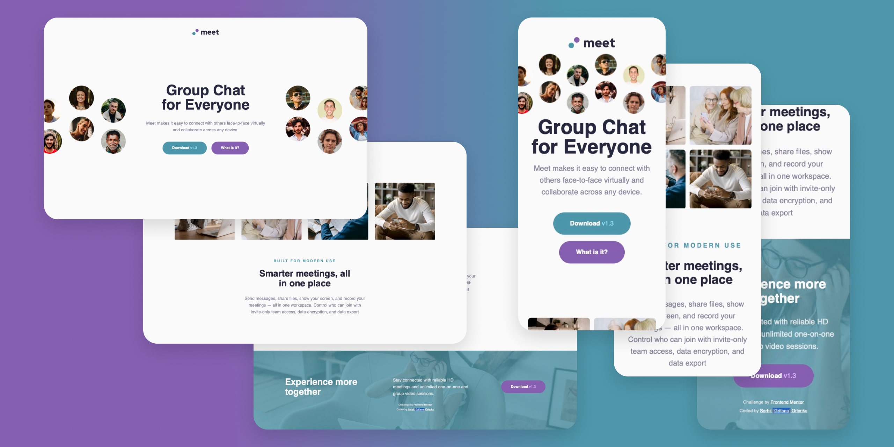

# Frontend Mentor - Meet landing page

This is a solution to the [Meet landing page challenge on Frontend Mentor](https://www.frontendmentor.io/challenges/meet-landing-page-rbTDS6OUR).

## Table of contents

- [Overview](#overview)
  - [The challenge](#the-challenge)
  - [Screenshot](#screenshot)
  - [Links](#links)
- [My process](#my-process)
  - [Built with](#built-with)
  - [What I learned](#what-i-learned)
  - [Continued development](#continued-development)
  - [Useful resources](#useful-resources)
- [Author](#author)
<!-- - [Acknowledgments](#acknowledgments) -->

## Overview

### The challenge

Users should be able to:

- View the optimal layout depending on their device's screen size
- See hover states for interactive elements

### Screenshot



### Links ❗️

- Solution URL: [Solution]()
- Live Site URL: [Live]()

## My process

### Built with

- Semantic HTML5 markup
- JavaScript
- CSS custom properties
- Flexbox
- Grid
- Responsive images
- Responsive Website

### What I learned ❗️

I start to learning about Grid. So, this is my first Implementation with this Layout Features. Such nice feelings 😊
```css
.what-is-it__row {
  display: grid;
  grid-template-columns: repeat(auto-fit, minmax(151px, 1fr));
  grid-column-gap: 30px;
  grid-row-gap: 10px;
  list-style-type: none;
  margin: 0px 0px 80px 0px;
  @media (max-width: 955px) {
    grid-column-gap: 10px;
  }
}
```

I decided to find a solution for smooth transition between sections. And this manual to help me to do that. I don't wont to use a JQuery because it's just for one function, and don't need such a heavy Library like as JQuery.
```js
<script>
  const links = document.querySelectorAll(".hero__button");

  for (const link of links) {
    link.addEventListener("click", clickHandler);
  }

  function clickHandler(e) {
    e.preventDefault();
    const href = this.getAttribute("href");
    const offsetTop = document.querySelector(href).offsetTop;

    scroll({
      top: offsetTop,
      behavior: "smooth"
    });
  }
</script>
```

### Continued development

I want to continue to learn a JavaScript. Currently, I'm working on Course from Udemy. App Brewery Web Developer Bootcamp. And to do practice, practice and practice one more 😉

### Useful resources ❗️

[How to Implement Smooth Scrolling With Vanilla JavaScript](https://webdesign.tutsplus.com/tutorials/smooth-scrolling-vanilla-javascript--cms-35165)
[Create Flexible Layouts Using auto-fit](https://www.freecodecamp.org/learn/responsive-web-design/css-grid/create-flexible-layouts-using-auto-fit)


## Author

- Website - [Serhii "{Grifano}" Orlenko"](https://grifano.webflow.io/)
- Frontend Mentor - [@Grifano](https://www.frontendmentor.io/profile/Grifano)
- Twitter - [@Grifano](https://twitter.com/OrlenkoSerhii)
- LinkedIn - [@Grifano](https://www.linkedin.com/in/serhii-orlenko-44aaa4a3/)

## Acknowledgments ❗️
